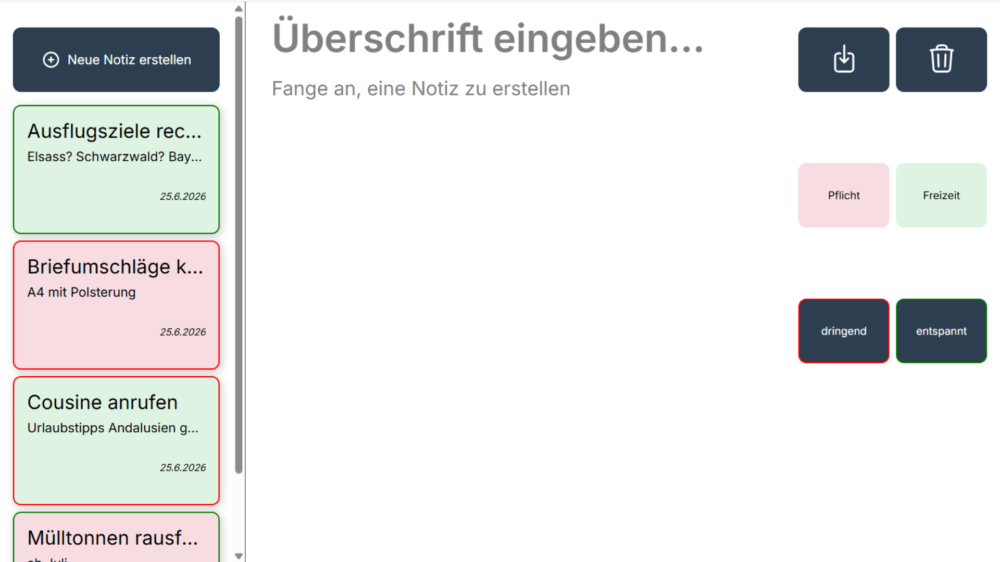

# Notiz-App



Eine moderne, digitale Variante eines klassischen Notizblocks. Diese Web-App bietet ein zweigeteiltes Interface, mit dem Notizen flexibel erstellt, editiert, farblich kategorisiert und nach Dringlichkeit priorisiert werden können. Dank lokaler Datenhaltung bleiben alle Einträge dauerhaft gespeichert.

## 🚀 Funktionen

* **Zweigeteiltes Layout:** Linke Seitenleiste (`20%` Breite) zur Auflistung und Auswahl der Notizen, rechter Hauptbereich (`80%` Breite) zur Inhaltspflege.
* **Vollständige CRUD-Operationen:** 
  * **Create:** Erstellen neuer Notizen über den Button `Neue Notiz erstellen`.
  * **Read:** Laden und Anzeigen aller existierenden Notizen in einer strukturierten Grid-Übersicht.
  * **Update:** Bestehende Notizen anklicken, im Editor anpassen und über das Speichern-Symbol aktualisieren.
  * **Delete:** Löschen der aktuell ausgewählten Notiz über das Mülleimer-Symbol.
* **Intelligentes Sortiersystem:** Die aktuell ausgewählte Notiz springt automatisch an die oberste Position. Alle weiteren Notizen werden chronologisch nach dem aktuellsten Datum absteigend sortiert.
* **Dynamisches Kategoriestyling:** 
  * **Bereich:** Einteilung in **Pflicht** (Rottöne) oder **Freizeit** (Grüntöne).
  * **Priorität:** Rahmen-Zuweisung für **Dringend** (Rot) oder **Entspannt** (Grün).
  * **Hintergrund entfernen:** Setzt die Karte auf das neutrale Standard-Design zurück.
* **Zustands-Synchronisation:** Stil-Änderungen (Farbe/Rahmen) werden bei einer bereits ausgewählten Notiz sofort im Speicher aktualisiert und visuell neu gerendert.

## 🛠️ Technologien

* **HTML5:** Semantischer Aufbau der Benutzeroberfläche unter Verwendung nativer SVG-Vektorgrafiken für moderne, skalierbare Icons.
* **CSS3 (Flexbox & Grid):** 
  * `CSS Flexbox` für das übergeordnete Anwendungs- und Editor-Layout.
  * `CSS Grid` für die Notizkarten-Liste und das kompakte, zweispaltige Button-Bedienfeld.
  * Vermeidung von visuellem Ruckeln durch clevere Spezifität und einen transparenten 3px-Platzhalter-Rahmen (`border: 3px solid transparent`).
  * Typografie über die Google Font **Inter**.
* **JavaScript (Vanilla JS):** Event-gesteuerte DOM-Manipulation ohne externe Frameworks.

## ⚙️ Technische Highlights

### 🔒 Cross-Site-Scripting (XSS) Schutz
Zur Absicherung gegen Schadcode-Injektionen besitzt das Projekt eine native `securityCheck()`-Sicherheitsfunktion. Alle vom Benutzer eingegebenen Zeichenketten durchlaufen vor dem Rendern im DOM eine HTML-Entity-Maskierung:
* `&` wird zu `&amp;`
* `<` wird zu `&lt;`
* `>` wird zu `&gt;`
* `"` wird zu `&quot;`

### 🔑 ID-Generierung & UUID
Für eine eindeutige Objekt-Identifizierung nutzt die App die moderne Web Crypto API:
* Primär wird eine kryptografisch sichere **UUIDv4** via `crypto.randomUUID()` generiert.
* Für ältere Browser oder restriktive lokale Umgebungen greift ein automatischer Zeitstempel-Fallback (`"note-" + Date.now()`) gegriffen.

### 💾 Datenhaltung (Local Storage)
Sämtliche Notiz-Objekte werden als JSON-String im `localStorage` unter dem Schlüssel `storedNotes` persistiert. Dadurch bleibt der Bearbeitungsstand auch nach dem Schließen des Browser-Tabs oder dem Neuladen der Seite vollständig erhalten.

## 📦 Installation & Start

1. Klone das Repository auf deinen lokalen Computer:
   ```bash
   git clone https://github.com
   ```
2. Überprüfe die Vollständigkeit der Projektstruktur im Ordner:
   ```text
   ├── images/
   │   └── previewNotizApp.png
   ├── index.html
   ├── index.css
   └── index.js
   ```
3. Führe die Anwendung aus:
   * Es ist kein Build-Schritt oder lokaler Server notwendig.
   * Öffne die Datei `index.html` einfach per Doppelklick in deinem bevorzugten Webbrowser (Chrome, Firefox, Edge, Safari).
